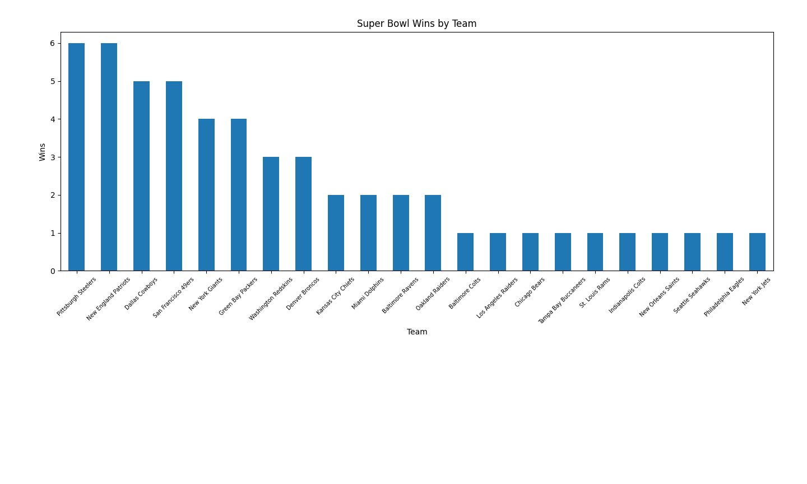
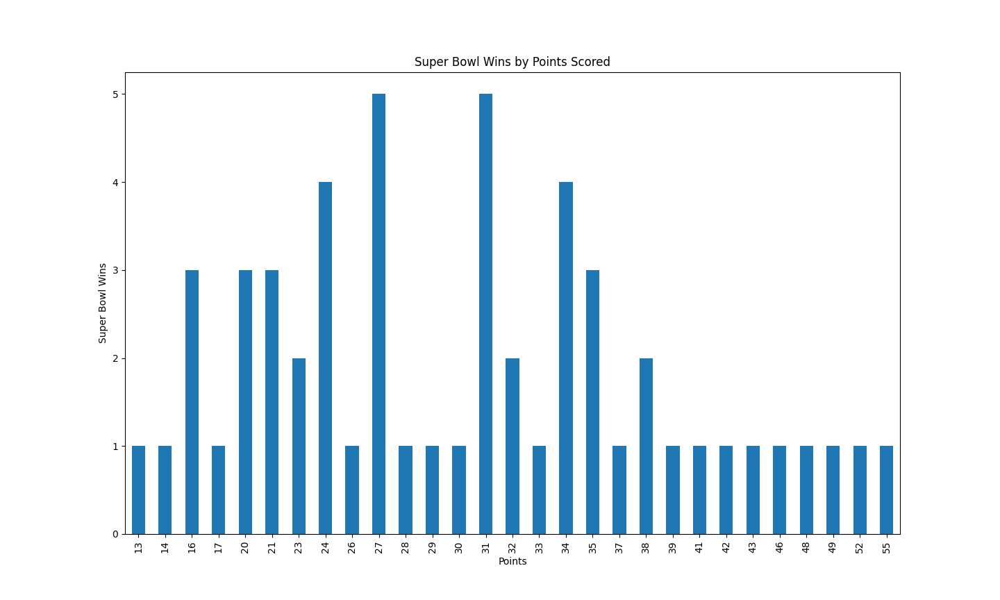
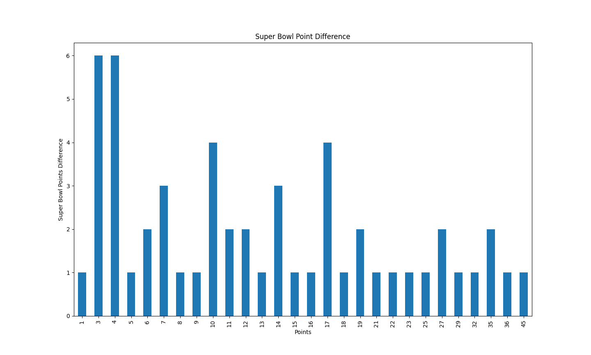

# Super Bowl Data Analysis

Exploratory analysis of Super Bowl history using Python + Pandas.  
Dataset includes winner/loser, points, MVP, stadium/city/state.

## Dataset
- Source: Kaggle — Super Bowl History
- File: `superbowl.csv`

## Questions explored
- Which teams win most often?
- What winning scores occur most frequently?
- How big are point differences (close games vs blowouts)?

## Tech
Python • Pandas • Matplotlib • PyCharm

## Key insights
- Winning scores cluster around the high-20s/low-30s (e.g., 27, 31).
- Most games are decided by ~10–20 points; a few are major blowouts.
- Pitsburg Steelers and Patriots lead with most Super Bowl wins (6) 

## Visualizations
**Wins by Team**  


**Common Winning Scores**  


**Distribution of Point Differences**  


## Reproduce
```bash
pip install pandas matplotlib
python main.py

